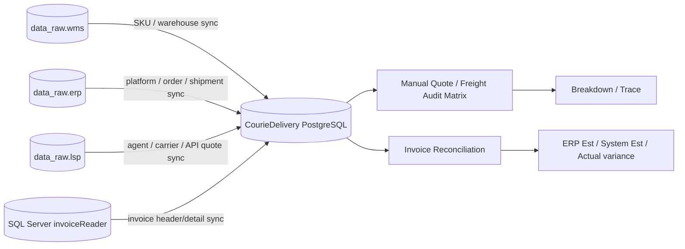
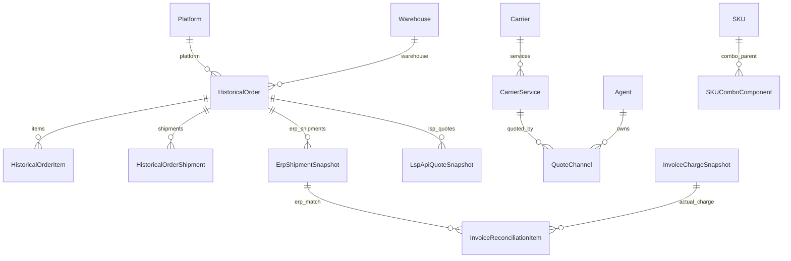

# ERP / LSP / WMS 数据关系与匹配字段说明

本文档说明 Freight Intelligence 当前从 ERP、LSP、WMS、InvoiceReader 读取数据时的来源表、落地表、匹配字段、兜底逻辑和已知限制。内容以 2026-06-23 当前项目代码为准，供后续开发、联调、对账和交给 GPT 评估系统完整性使用。

## 总体原则

系统不在前端请求时直接跨库读取 ERP/LSP/WMS。所有外部数据先通过 Django management command 同步或导入到 CourieDelivery PostgreSQL 的 master/snapshot/template 表，然后报价、审计、对账都从本地库读取。



关键原则如下：

- `QuoteEngine` 只使用 CourieDelivery 本地 master、rate card、quote channel、SKU/order snapshot，不直接访问 ERP/LSP/WMS。
- ERP 运费预估值目前按订单级别处理；多 tracking 订单必须先汇总到 owner order 再与 ERP Est 比较。
- InvoiceReader 实际收费按 tracking/consignment 进入系统；对账优先使用 tracking 匹配 ERP shipment snapshot。
- LSP API quote 是历史报价证据，很多行不是 ERP 订单触发的正式报价，不能强行模糊匹配。
- WMS/ERP/LSP 的远程读取应集中在同步命令里，前端页面只读本地 API。

## 本地核心表关系



| 本地模型/表 | 作用 | 主要外部来源 | 关键匹配字段 |
|---|---|---|---|
| `SKU` | 单 SKU 和 combo 父 SKU 尺寸、重量、category 快照 | WMS `bas_sku`；ERP combo 表 | `sku` |
| `SKUComboComponent` | combo SKU 组件快照 | ERP `hpoms_product_combo*` | `combo_sku` + `component_sku` |
| `Warehouse` | 仓库、地址、state、postcode、发货地判断 | WMS `bsm_warehouse` | `code` / `source_external_id` |
| `Platform` | 销售平台和快递报价平台 master data | ERP `hpoms_platform_info` | `code` / `source_external_id` |
| `Agent` | Broers、EIZ、SHIPPIT、UBI 等 agent master data | LSP `lsp_carrier_agent` + quote history 兜底 | `code` / `lsp_consign_agent_id` |
| `Carrier` | 快递公司 master data | LSP carrier 相关表、本地导入 | `code` / `source_external_id` |
| `CarrierService` | carrier 下的具体服务/渠道 | LSP/API/rate table 配置 | `carrier` + `code` |
| `QuoteChannel` | 实际可计算的报价渠道 | PostageCalculator/rate table/API 配置 | `code` |
| `HistoricalOrder` | ERP 订单轻量快照 | ERP owner order 和 manual order | `source_system` + `source_external_id` |
| `HistoricalOrderItem` | 订单销售 SKU 行快照 | ERP purchase SKU 表 | `order` + `sku` |
| `HistoricalOrderShipment` | ERP shipment/tracking 行快照 | ERP shipment detail | `order` + `source_external_id` |
| `ErpShipmentSnapshot` | 对账用 shipment 级快照 | ERP shipment detail + owner/core order | `source_system` + `source_external_id`；`tracking_no` |
| `LspApiQuoteSnapshot` | LSP API quote 请求/返回快照 | LSP OpenAPI quote task | `source_system` + `source_external_id` |
| `InvoiceChargeSnapshot` | InvoiceReader 实收费用快照 | invoice header/detail 表 | `source_system` + `source_external_id`；`tracking_no` |
| `InvoiceReconciliationItem` | ERP/System/Invoice 对账结果 | 本地 snapshot 匹配结果 | `invoice_charge_snapshot` + `erp_shipment_snapshot` |

## WMS 数据来源与匹配

### SKU Master

来源：`data_raw.wms.bas_sku`

同步命令：`manage.py sync_sku_from_wms`

| WMS 字段 | CourieDelivery 字段 | 用途 |
|---|---|---|
| `sku` | `SKU.sku` | SKU 唯一键；报价时按这个字段找尺寸和重量 |
| `skuDescr1` / `skuDescr2` 等描述字段 | `SKU.description` | 前端 SKU 下拉和订单明细展示 |
| `sku_Group2` | `SKU.category` | SKU category，允许中文显示 |
| 重量字段，如 gross/net weight | `SKU.unit_weight_kg` | 实重 |
| 长宽高字段 | `SKU.length_cm` / `width_cm` / `height_cm` | 体积重和 oversize 预判 |
| 启用状态字段 | `SKU.active` | 控制 SKU 是否可选 |
| 更新时间字段 / `_airbyte_extracted_at` | `SKU.source_updated_at` / `source_extracted_at` | 增量同步水位 |
| 原始行 | `SKU.source_payload_json` | 排错保留 |

匹配逻辑：

- `SKU.sku` 是系统内 SKU 主键。
- Manual Quote 的 SKU/Combo SKU 输入框和批量选择弹窗都查本地 `SKU`。
- 订单导入时，ERP SKU 行会用本地 `SKU.sku` 补充尺寸、重量和 category。
- 如果 ERP 订单中的 SKU 本地找不到，系统仍可保留订单行，但尺寸和重量会缺失，报价准确性下降。

### Combo SKU

来源：`data_raw.erp.hpoms_product_combo`、`data_raw.erp.hpoms_product_combo_skus`

虽然 combo SKU 业务上属于商品主数据，但当前来源是 ERP，不是 WMS。系统把 combo 父 SKU 存成 `SKU.is_combo = true`，组件存入 `SKUComboComponent`。

| ERP 字段 | CourieDelivery 字段 | 用途 |
|---|---|---|
| `hpoms_product_combo.combo_sku` | `SKU.sku` / `SKUComboComponent.combo_sku` | combo 父 SKU |
| `hpoms_product_combo_skus.owner_sku` / `sku` | `SKUComboComponent.component_sku` | 子 SKU |
| `quantity` | `SKUComboComponent.qty` | 组件数量 |
| `combo_type` | `SKU.combo_type` / `source_payload_json` | combo 类型，需要按 ERP 字典解释 |
| 标题/描述 | `SKU.description` | 前端展示 |
| 更新时间字段 | `source_updated_at` | 增量同步水位 |

匹配和计算逻辑：

- 用户选择 combo SKU 时，报价前先展开成 component SKU 快照。
- combo 数量会乘以每个 component 的数量。
- 组件尺寸、重量优先使用本地 `SKU` 中对应 component SKU 的 WMS 快照。
- combo 类型数字必须来自 ERP 字典或 DDL 证据，不能凭猜测写死。

### Warehouse Master

来源：`data_raw.wms.bsm_warehouse`

同步命令：`manage.py sync_warehouses_from_wms`

| WMS 字段类型 | CourieDelivery 字段 | 用途 |
|---|---|---|
| 仓库 code/id，如 `warehouseCode`、`warehouse_code`、`code`、`id` | `Warehouse.code` / `source_external_id` | ERP warehouse 关联主键 |
| 仓库名称，如 `warehouseDescr` | `Warehouse.name` | 前端显示，只显示干净名称，例如 `BG01` |
| 地址字段 | `Warehouse.address` / `address2` | 发货地址展示和排错 |
| `city` / suburb 字段 | `Warehouse.suburb` | 发货 suburb |
| `postcode` | `Warehouse.postcode` | 发货 postcode |
| `state` | `Warehouse.state` | 判断 MEL/SYD 发货地和 rate card origin |
| 国家/区域/联系方式 | 对应 `Warehouse` 字段 | 配置展示 |
| 更新时间字段 / `_airbyte_extracted_at` | `external_updated_at` / `source_extracted_at` | 增量同步水位 |

ERP 订单 warehouse 匹配优先级：

1. `hpoms_orders.wash_warehouse_code`
2. `hpoms_owner_order_shipment_detail.warehouse_code`
3. `hpoms_owner_order.warehouse_owner_code`
4. `hpoms_owner_order_shipment_detail.warehouse_owner_code`

本地匹配方式：

- 优先与 `Warehouse.code` 精确匹配。
- 再与 `Warehouse.source_external_id` 匹配。
- 如果无法匹配，订单仍保存原始 warehouse code，但 UI 会显示未映射，报价时只能走 `ALL warehouses` 或需要补 master data。

发货地对 rate card 的影响：

- `Warehouse.state = VIC` 时只应参与 MEL origin rate card。
- `Warehouse.state = NSW` 时只应参与 SYD origin rate card。
- 没有 state 的仓库会影响 Hunter/Allied/DFE 这类区分 EX MEL / EX SYD 的计算准确性。

## ERP 数据来源与匹配

### Platform Master

来源：`data_raw.erp.hpoms_platform_info`

同步命令：`manage.py sync_platforms_from_erp`

| ERP 字段 | CourieDelivery 字段 | 用途 |
|---|---|---|
| `id` | `Platform.code` / `source_external_id` | 平台关联主键 |
| `name` | `Platform.name` | 前端平台名称 |
| `company` | `Platform.company` | 公司名 |
| `platform_type` | `source_platform_type_code` + 中英文名称 | 区分平台类型 |
| `platform_group` | `platform_group_code` + 中英文名称 | 平台分组 |
| `legal` / legal name | `Platform.legal_name` | 配置展示 |
| `status` | `Platform.active` | 激活状态 |
| 更新时间字段 / `_airbyte_extracted_at` | `external_updated_at` / `source_extracted_at` | 增量同步水位 |

类型解释：

- `platform_type` 和 `platform_group` 必须从 ERP 字典/DDL 证据解析。
- 平台 group 使用 ERP 字典表，例如 `hpoms_dictionary`、`hpoms_dictionary_value`、`hpoms_dictionary_value_desc`，通过主/子 code 找到真实中英文标签。
- 订单导入时用 `hpoms_owner_order.platform_id` 或 `hpoms_orders.platform_id` 匹配 `Platform.code` / `source_external_id`。

### ERP Owner Order

主要来源：

- `data_raw.erp.hpoms_owner_order`
- `data_raw.erp.hpoms_orders`
- `data_raw.erp.hpoms_order_address`
- `data_raw.erp.hpoms_order_shipping_estimated_detail`
- `data_raw.erp.hpoms_owner_order_purchase_skus`
- `data_raw.erp.hpoms_owner_order_shipment_detail`

同步命令：`manage.py sync_orders_from_erp`

| ERP 字段 | CourieDelivery 字段 | 用途 |
|---|---|---|
| `hpoms_owner_order.id` | `HistoricalOrder.source_external_id` | 本地订单唯一来源 ID |
| `hpoms_owner_order.order_id` | `HistoricalOrder.order_no` / `erp_order_no` | ERP Order No |
| `owner_order_no` | `HistoricalOrder.erp_owner_order_no` | Owner Order No |
| `rd3_order_id` | `HistoricalOrder.external_order_no` | 第三方/外部单号 |
| `platform_reference_no` | `HistoricalOrder.platform_order_no` | Platform Order No |
| `platform_id` | `HistoricalOrder.platform` | 销售平台匹配 |
| `shipping_option` | `HistoricalOrder.shipping_option` | 发货方式 |
| `date_placed` / `created_at` | `HistoricalOrder.order_date` | 订单日期 |
| address `city/state/postcode` | `suburb` / `state` / `postcode` | 目的地 |
| latest shipment `tracking` | `HistoricalOrder.consignment_no` | 历史兼容字段；多 tracking 时不能只看它 |
| latest shipment carrier/channel/service | `actual_carrier` / raw payload | ERP 实发快递信息 |
| `postage_shipping_estimated_amount` | `postage_shipping_estimated_amount` / `source_estimated_freight` | ERP 运费预估，当前按 ex GST 处理 |
| `shipping_estimated_amount` | `source_estimated_freight` 兜底 | ERP 预估兜底 |
| `updated_at` / `_airbyte_extracted_at` | `source_updated_at` | 增量同步水位 |

订单类型：

- `source_order_type = PLATFORM`：平台订单。
- `source_order_type = THIRD_PARTY`：第三方订单。
- `source_order_type = ERP` 或 manual source：人工/ERP 内部订单。

订单匹配原则：

- 本地唯一约束是 `HistoricalOrder.source_system + source_external_id`。
- UI 输入 ERP Order No / Platform Order No / tracking 时，会查多个字段，不只查 `order_no`。
- `rd3_order_id` 作为外部单号，`platform_reference_no` 作为平台单号，二者都需要保留。

### ERP Sales SKU Lines

来源：`data_raw.erp.hpoms_owner_order_purchase_skus`

| ERP 字段 | CourieDelivery 字段 | 用途 |
|---|---|---|
| `owner_order_id` | `HistoricalOrderItem.order` | 通过 `HistoricalOrder.source_external_id` 关联 |
| `owner_purchase_sku` / `purchase_sku` / `sku` | `HistoricalOrderItem.sku` | SKU |
| `quantity` | `HistoricalOrderItem.qty` | 数量 |
| 本地 SKU 快照 | `unit_weight_kg` / `length_cm` / `width_cm` / `height_cm` | 报价输入快照 |

计算影响：

- Manual Quote 的 ERP/Platform Order tab 会把这些 SKU 行带出。
- 如果 SKU 是 combo，系统应在报价前展开成 component SKU。
- ERP Est 是订单级别；SKU 行只是系统重新计算运费的输入，不代表 ERP Est 的分摊口径。

### ERP Shipment / Tracking

来源：`data_raw.erp.hpoms_owner_order_shipment_detail`

落地表：

- `HistoricalOrderShipment`：面向订单页面、Manual Quote、LSP quote 展示。
- `ErpShipmentSnapshot`：面向 Invoice Reconciliation 和 Freight Audit Matrix。

| ERP shipment 字段 | `HistoricalOrderShipment` 字段 | `ErpShipmentSnapshot` 字段 | 用途 |
|---|---|---|---|
| `id` | `source_external_id` | `source_external_id` | shipment 行唯一键 |
| `tracking` | `tracking_no` | `tracking_no` | invoice 和 LSP 展示的核心匹配字段 |
| `owner_order_id` | `order` | `order` | 关联 `HistoricalOrder.source_external_id` |
| `carrier` | `carrier_name` | `carrier_name` | ERP 实发快递 |
| `carrier_channel` | `carrier_channel` | `carrier_channel` | ERP 实发渠道 |
| `service_providers` | `service_provider` | `service_provider` | ERP service/provider |
| `carrier_channel_account` | `carrier_channel_account` | `carrier_channel_account` | 快递账号 |
| `warehouse_code` | `warehouse_code` | `warehouse_code` 兜底 | 仓库 |
| `warehouse_owner_code` | `warehouse_owner_code` | `warehouse_code` 兜底 | 仓库 owner code |
| `package_no` | `package_no` | raw payload | 包裹编号 |
| `purchase_sku` / `owner_purchase_sku` | 对应字段 | raw payload | shipment SKU 信息 |
| `qty` | `qty` | raw payload | shipment 数量 |
| `status` | `status_code` | raw payload | shipment 状态 |

`ErpShipmentSnapshot` 会额外 join：

- `hpoms_owner_order`：ERP order no、owner order no、rd3 order、platform reference、ERP estimate。
- `hpoms_orders`：core order no、platform、warehouse、shipping option。
- `hpoms_platform_info`：platform name/company。

`ErpShipmentSnapshot.estimated_freight` 来源优先级：

1. `hpoms_owner_order.postage_shipping_estimated_amount`
2. `hpoms_owner_order.shipping_estimated_amount`

注意事项：

- `estimated_freight` 当前是 ERP 订单级 ex GST 预估。
- 如果一个 order 有多个 tracking，实际 invoice 和系统估算都要按订单汇总后再与 ERP Est 比较。
- 不要把一个 tracking 的系统估算直接与 ERP Est 比较，除非确认 ERP Est 就是 tracking 级别。

### ERP Manual Orders

来源：

- `data_raw.erp.hpoms_manual_orders`
- `data_raw.erp.hpoms_manual_order_address`
- `data_raw.erp.hpoms_manual_order_skus`

| ERP 字段 | CourieDelivery 字段 | 用途 |
|---|---|---|
| `hpoms_manual_orders.id` | `HistoricalOrder.source_external_id` | 本地唯一来源 ID |
| `manual_order_no` / `order_id` | `HistoricalOrder.order_no` | 人工订单号 |
| `platform_id` | `HistoricalOrder.platform` | 平台匹配 |
| `warehouse_owner_code` | `HistoricalOrder.warehouse` 兜底 | 仓库匹配 |
| `shipping_option` | `HistoricalOrder.shipping_option` | 发货方式 |
| manual address | `suburb` / `state` / `postcode` | 目的地 |
| manual skus `sku` + `quantity` | `HistoricalOrderItem` | 系统重新估算输入 |

### Manual Quote 的订单查询字段

Manual Quote 的 ERP/Platform Order tab 不应只查一个字段。当前应覆盖：

| 用户可能输入 | 本地查询字段 |
|---|---|
| ERP Order No | `HistoricalOrder.order_no`、`erp_order_no` |
| Owner Order No | `HistoricalOrder.erp_owner_order_no` |
| Platform Order No | `HistoricalOrder.platform_order_no` |
| 第三方/外部单号 | `HistoricalOrder.external_order_no` |
| Consignment | `HistoricalOrder.consignment_no` |
| Tracking | `HistoricalOrderShipment.tracking_no`、`ErpShipmentSnapshot.tracking_no` |
| LSP order/shipment reference | `LspApiQuoteSnapshot.lsp_order_code`、`lsp_shipment_code` |

返回页面时应展示：

- ERP Order No
- Platform Order No
- 所有 tracking
- platform name
- warehouse code/name
- shipping option
- ERP Est inc GST 展示值
- ERP 实发 carrier/channel/service
- Sales SKU、Shipment SKU、Quote SKU
- 若匹配到 LSP historical API quote，则展示 LSP 当时选择价格和可展开的比价详情

## LSP 数据来源与匹配

### Agent Master

来源：`data_raw.lsp.lsp_carrier_agent`

同步命令：`manage.py sync_agents_from_lsp`

| LSP 字段 | CourieDelivery 字段 | 用途 |
|---|---|---|
| agent code/id | `Agent.code` / `source_external_id` | agent 唯一键 |
| agent name | `Agent.name` | 前端显示 |
| `status` | `Agent.active` / `lsp_status_code` | 激活状态 |
| `rate_type` | `Agent.lsp_rate_type` | LSP 侧计费类型参考 |
| `consign_agent_id` | `Agent.lsp_consign_agent_id` | LSP 关联 |

业务含义：

- Agent 是 Master Data，不是前端硬编码展示。
- 同一个 carrier 在不同 agent 下可能有不同 API 价格或不同维护方。
- `QuoteChannel.agent` 和 `ApiCredential.agent` 应保留 agent 归属。

### Carrier / Service

主要来源：

- `data_raw.lsp.lsp_carrier`
- `data_raw.lsp.lsp_carrier_channel`
- `data_raw.lsp.lsp_carrier_account`
- `data_raw.lsp.lsp_carrier_rate`
- `data_raw.lsp.lsp_carrier_quote_platform_rate`

同步/导入命令：`manage.py import_carriers_from_lsp`

| LSP 字段/统计 | CourieDelivery 字段 | 用途 |
|---|---|---|
| carrier code/id | `Carrier.code` / `source_external_id` | carrier 唯一键 |
| carrier name | `Carrier.name` | UI 显示必须用 name，不用纯数字 code |
| carrier status | `Carrier.active` / `lsp_status_code` | 激活状态 |
| agent code | `Carrier.lsp_agent_code` | agent 归属参考 |
| channel code | `Carrier.lsp_channel_code` | LSP channel |
| active rate rows count | `Carrier.active_rate_rows` | 判断 TABLE |
| quote platform rate rows count | `Carrier.active_quote_rate_rows` | 判断平台价卡 |
| active API account count | `Carrier.active_api_accounts` | 判断 API |

carrier type 判断：

- 只有 rate rows：`TABLE`
- 只有 active API account：`API`
- rate rows 和 API account 都有：`HYBRID`

注意：

- LSP rate raw 表不是当前主要计算模板。用户已要求系统使用 CourieDelivery/PostageCalculator/已导入的本地 rate template。
- LSP rate data 可作为参考或核对，不应在 operational sync 中覆盖已确认的本地 calculator。

### LSP API Quote Snapshot

主要来源：

- `data_raw.lsp.lsp_openapi_quote_task`
- `data_raw.lsp.lsp_quote_task`
- `data_raw.lsp.lsp_booking_order`
- `data_raw.erp.hpoms_scp_so_execute`
- `data_raw.erp.hpoms_owner_order`

同步命令：`manage.py sync_lsp_api_quotes`

| LSP/ERP 字段 | CourieDelivery 字段 | 用途 |
|---|---|---|
| `lsp_openapi_quote_task.id` | `LspApiQuoteSnapshot.source_external_id` | API quote 唯一键 |
| `lsp_openapi_quote_task.quote_id` | `quote_id`，并 join `lsp_quote_task.id` | 连接 quote task |
| `lsp_quote_task.id` | `quote_task_id` | LSP quote task id |
| `lsp_quote_task.order_code` | `lsp_order_code` | LSP 内部/reference code，通常不等于 ERP order |
| `lsp_quote_task.shipment_code` | `lsp_shipment_code` | LSP shipment/reference code |
| `lsp_quote_task.warehouse_code` | `warehouse_code` | LSP 仓库参考 |
| `request_id` | `request_id` | API 请求 ID |
| request JSON | `request_summary_json` | 请求摘要 |
| response JSON | `response_summary_json` / `raw_response_json` | 返回摘要和原始返回 |
| response quote list | `LspApiQuoteOption` | 各 carrier/API 返回价格 |
| selected/predict carrier | `predicted_carrier_code/name` | LSP 当时选中的 carrier |
| selected/predict price | `predicted_shipping_cost` / `predict_price` | LSP 当时价格 |
| booking `tracking_number` | `booking_tracking_no` | 仅辅助匹配 |
| booking `freight` | `booking_freight` | LSP booking freight |
| ERP matched owner order | `historical_order`、`source_order_id` | 匹配到本地订单 |

推荐匹配路径：

1. `lsp_openapi_quote_task.quote_id -> lsp_quote_task.id`
2. `lsp_quote_task.shipment_code -> lsp_booking_order.shipment_code`
3. `lsp_booking_order.reference_no` 或 booking `shipment_code`
4. 规范化去掉包裹尾缀，例如 `_1`、`-P1`、`_P1`、`-1`
5. 匹配 ERP `hpoms_owner_order.rd3_order_id`、`platform_reference_no`、`owner_order_no`
6. 找到本地 `HistoricalOrder.source_external_id`

兜底匹配路径：

1. `lsp_quote_task.order_code -> erp.hpoms_scp_so_execute.from_order_no`
2. `hpoms_scp_so_execute.tid -> hpoms_owner_order.rd3_order_id`
3. 匹配本地 `HistoricalOrder`

本地 rematch 还会尝试：

- `LspApiQuoteSnapshot.source_order_id -> HistoricalOrder.source_external_id`
- `booking_tracking_no -> HistoricalOrderShipment.tracking_no`
- `booking_tracking_no -> HistoricalOrder.consignment_no`
- `erp_order_no`、`erp_owner_order_no`、`external_order_no`、`platform_order_no`
- `source_platform_id -> Platform.code/source_external_id`

已知限制：

- `lsp_quote_task.order_code` 很多时候是 LSP 内部请求号，不可靠。
- `lsp_booking_order.tracking_number` 很多历史 API quote 行不能直接匹配 ERP shipment tracking。
- 当前大量 LSP API snapshots 缺 `source_order_id`、ERP order、external order、platform order，只保留 `lsp_order_code` / `lsp_shipment_code`，必须保留为未匹配历史证据，不要强行删除。

### LSP Quote Log

主要来源：

- `data_raw.lsp.lsp_quote_task_job`
- `data_raw.lsp.lsp_quote_task_job_log`

同步命令：`manage.py sync_lsp_quote_logs`

关系：

- `lsp_openapi_quote_task.quote_id -> lsp_quote_task.id`
- `lsp_quote_task.id -> lsp_quote_task_job.quote_task_id`
- `lsp_quote_task_job.id -> lsp_quote_task_job_log.quote_task_job_id`
- 本地落到 `LspQuoteTaskLogItem`

用途：

- Manual Quote 的 ERP/Platform Order 查询展开 LSP 历史报价时，可以显示 LSP 当时各 agent/carrier 的返回详情。
- 排查为什么 LSP 当时选了某个 carrier，或者为什么某个 API carrier not available。

## InvoiceReader 与 ERP 的对账匹配

虽然 InvoiceReader 不属于 ERP/LSP/WMS，但它是三者数据关系的最终验证环节。

来源：

- SQL Server `invoiceReader.dbo.invoice_header_local_freight`
- SQL Server `invoiceReader.dbo.invoice_detail_*` 生产明细表

同步命令：

- `manage.py sync_invoices_from_sqlserver`
- `manage.py sync_reconciliation_snapshots`

| InvoiceReader 字段 | CourieDelivery 字段 | 用途 |
|---|---|---|
| header invoice no/date/source | `InvoiceChargeSnapshot.invoice_no` / `invoice_date` / source fields | invoice 主信息 |
| detail tracking/connote | `InvoiceChargeSnapshot.tracking_no` | 与 ERP shipment 匹配 |
| carrier/source/account | `invoice_source` / `carrier_name` / `service_name` / `freight_account` | 区分 agent + courier service |
| charge amount | `actual_freight` | 实收金额，系统内按 inc GST 归一 |
| source line grouping | `source_line_count` / `raw_payload` | 多费用行合并和排错 |

对账匹配路径：

1. `InvoiceChargeSnapshot.tracking_no -> ErpShipmentSnapshot.tracking_no`
2. 如果多个 ERP shipment 同 tracking，用 `carrier_name`、`carrier_channel`、`service_provider`、`carrier_channel_account` 打分消歧。
3. 匹配成功后，把 `ErpShipmentSnapshot.erp_order_no` 写入 `InvoiceReconciliationItem.order_no`。
4. `estimated_freight` 保存 ERP Est 原始口径；serializer 额外提供 inc GST 展示值。
5. `system_estimated_freight` 保存 CourieDelivery 当前 calculator 算出的 inc GST 值。

重要口径：

- Invoice actual：inc GST。
- System Est：inc GST。
- ERP Est：源字段为 ex GST，外层 UI/export 应显示 backend 提供的 inc GST 字段。
- 多 tracking 订单：实际收费和系统估算应汇总到 order 后再与 ERP Est 比较。

## Freight Audit Matrix 的数据关系

Freight Audit Matrix 是历史订单重新计算和跨快递比价的主要模块。

输入来源：

- `HistoricalOrder`
- `HistoricalOrderItem`
- `HistoricalOrderShipment`
- `ErpShipmentSnapshot`
- `QuoteChannel`
- `RateCard` / calculator tables

模式说明：

| 模式 | 输入粒度 | 与 ERP Est 比较方式 | 适用场景 |
|---|---|---|---|
| `CONSIGNMENT` | 一个 owner order 下的 tracking groups | 每个 tracking/consignment 计算后按 order 聚合 | invoice 对账、历史订单核价 |
| `ORDER` | 整单 SKU 一起计算 | 整单系统估算 vs ERP order estimate | 订单级预估 |
| `ITEM` | 单 SKU 行 | 不应与 ERP order estimate 直接比较 | 单品运费测试 |

origin 过滤：

- quote/audit 时，系统根据 `Warehouse.state` 过滤 EX MEL / EX SYD rate card。
- 例如 BGS1 设置为 NSW 时，只应参与 SYD 路费表；MEL 路费表不应参与比较。

展示口径：

- 外层列表只显示 inc GST total。
- base、surcharge、fuel、GST、adjustment 等明细只在 breakdown/detail 中显示。
- 多 tracking detail 需要按 tracking 分组和排序，不能全部挤进同一张表。

## 同步命令与调度

| 命令 | 读取来源 | 落地对象 | 用途 |
|---|---|---|---|
| `sync_sku_from_wms` | `data_raw.wms.bas_sku` | `SKU` | SKU 尺寸重量和 category |
| `sync_warehouses_from_wms` | `data_raw.wms.bsm_warehouse` | `Warehouse` | 仓库、地址、state |
| `sync_platforms_from_erp` | `data_raw.erp.hpoms_platform_info` | `Platform` | 平台 master data |
| `sync_agents_from_lsp` | `data_raw.lsp.lsp_carrier_agent` | `Agent` | agent master data |
| `import_carriers_from_lsp` | LSP carrier/channel/account/rate 相关表 | `Carrier`、`CarrierService` | carrier/service master data |
| `sync_orders_from_erp` | ERP owner/manual order 相关表 | `HistoricalOrder`、items、shipments | 历史订单快照 |
| `sync_lsp_api_quotes` | LSP OpenAPI quote task 相关表 | `LspApiQuoteSnapshot`、options | LSP 历史 API 报价 |
| `sync_lsp_quote_logs` | LSP quote task job/log | `LspQuoteTaskLogItem` | LSP 比价明细日志 |
| `sync_invoices_from_sqlserver` | InvoiceReader header/detail | `InvoiceChargeSnapshot`、batch/items | invoice 实收导入 |
| `sync_reconciliation_snapshots` | InvoiceReader + ERP shipment | `InvoiceChargeSnapshot`、`ErpShipmentSnapshot`、recon items | 推荐对账快照流程 |
| `sync_operational_data` | ERP/LSP/WMS master/order/quote | 多个 master/snapshot | 主 operational 同步 |

推荐 operational 同步：

```powershell
.\.venv\Scripts\python.exe backend\manage.py ensure_data_raw_sync_indexes --only-missing
.\.venv\Scripts\python.exe backend\manage.py sync_operational_data --incremental --order-batch-size 5000 --lsp-batch-size 1000 --log-batch-size 3000
```

全量同步：

```powershell
.\.venv\Scripts\python.exe backend\manage.py sync_operational_data --full --order-batch-size 5000 --lsp-batch-size 1000 --log-batch-size 3000
```

当前设计是每 10 小时做 ERP/LSP operational 增量同步；SKU 可按每天 AEDT 03:00 同步 WMS `bas_sku`。

## 搜索和排错用字段

| 排错问题 | 首选字段 | 兜底字段 |
|---|---|---|
| 一个 ERP 单为何查不到 | `HistoricalOrder.erp_order_no` / `order_no` | `erp_owner_order_no`、`external_order_no`、`platform_order_no` |
| 一个 tracking 为何对不上 invoice | `InvoiceChargeSnapshot.tracking_no` vs `ErpShipmentSnapshot.tracking_no` | `HistoricalOrderShipment.tracking_no` |
| 平台显示 ALL/Unmapped | ERP `platform_id` vs `Platform.code/source_external_id` | 检查 `hpoms_platform_info` 是否已同步 |
| 仓库显示 ALL/Unmapped | ERP `wash_warehouse_code` / shipment warehouse vs `Warehouse.code` | 检查 `bsm_warehouse` 是否已同步和 state 是否为空 |
| SKU 尺寸为空 | ERP SKU vs `SKU.sku` | 检查 WMS `bas_sku` 是否同步、combo 是否已展开 |
| LSP 历史报价未显示 | `historical_order` / `source_order_id` / order refs | `lsp_order_code`、`lsp_shipment_code`、booking reference |
| ERP Est 似乎不对 | `ErpShipmentSnapshot.estimate_source` | `postage_shipping_estimated_amount`、`shipping_estimated_amount` |
| 系统估算与 invoice 差异大 | `FreightAuditResult.breakdown` | rate card origin、zone、chargeable kg、surcharge、fuel |

## 已知风险和开发边界

- LSP API quote 与 ERP 订单的关系不是天然一对一；必须保留未匹配快照作为历史证据。
- ERP Est 当前按订单级处理；如果未来确认存在 tracking 级 ERP Est，需要新增字段和口径，不要复用现字段误导对账。
- InvoiceReader detail 表不同 carrier 格式不同，只能使用已确认 mapping，不应扫描所有 `invoice_detail%` 后猜 amount 字段。
- WMS warehouse `state` 是 origin rate card 过滤的关键字段；缺失会直接影响 MEL/SYD 费率选择。
- Combo SKU 的类型数字必须通过 ERP 字典解释，不能写成猜测值。
- LSP rate raw 表可以用来核对，但不应自动覆盖系统已确认的 PostageCalculator / Broers / DFE / OrangeConnex / UBI template。

## 给后续开发的检查清单

- 新增任何外部同步字段时，同时更新本地 model、serializer、前端展示、HTML 文档。
- 新增 invoice source 时，先确认 header/detail 表、tracking 字段、金额是否含 GST、是否需要多行聚合。
- 新增 carrier calculator 时，先明确 origin、zone mapping、chargeable weight、multi-item/multi-tracking 规则、fuel/GST/oversize/surcharge 口径。
- 新增 LSP/API agent 时，必须落到 `Agent` master data，并关联 `QuoteChannel.agent` 或 `ApiCredential.agent`。
- 做 ERP/LSP/WMS 全量同步前先跑 `ensure_data_raw_sync_indexes --only-missing`，避免大表无索引扫描。
