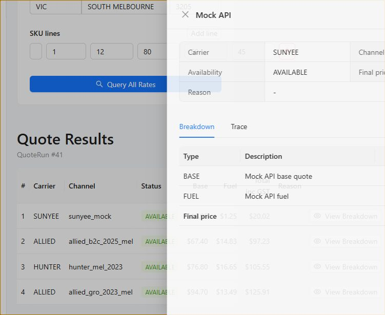
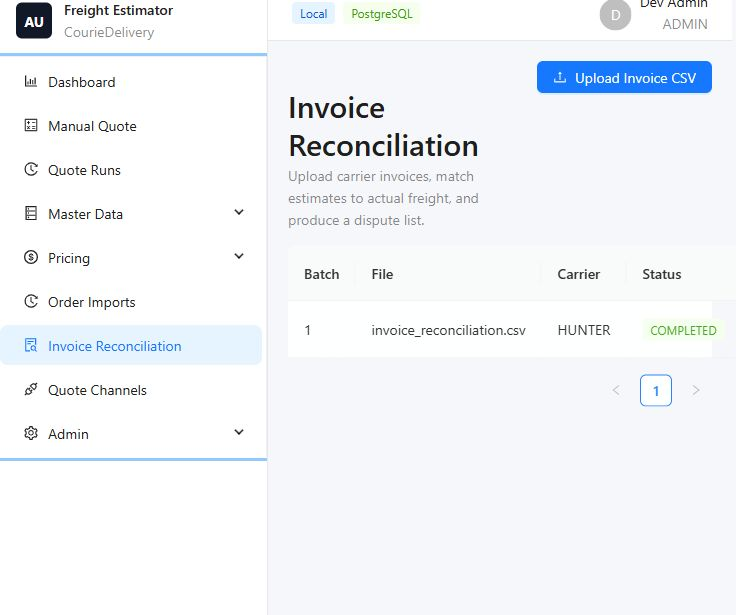
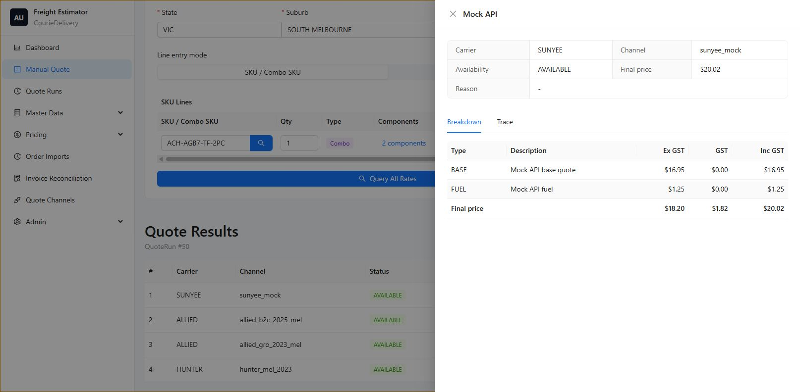

# 运费明细、计算追踪与账单对账说明

更新时间：2026-05-22

本文档说明 CourieDelivery / AU Freight Estimator 中新增的三类关键业务能力：

- 运费计算明细 Breakdown
- Quote Trace / 计算追踪日志
- Invoice Reconciliation / 预估运费与实际账单对账
- Rate Card 版本与生效日期管理

这些能力的目标是让每一次报价都可以解释、可以回溯、可以对账，避免只看到一个总价却无法判断价格来源。

## 1. 运费计算明细 Breakdown

每条报价结果都会保存并展示明细费用，不只返回最终总价。

前端入口：

- `Manual Quote` 页面每条报价结果右侧有 `View Breakdown` 按钮。
- 点击后打开抽屉，`Breakdown` 标签页显示逐项费用。
- `Quote Runs` 历史页面也可以打开每次报价的候选结果，并查看对应 Breakdown。

数据库表：

- `quote_result_breakdown`

后端模型：

- `QuoteChargeLine`

每条 breakdown line 包含：

- `line_type`：费用类型，例如 `BASE`、`FUEL`、`SURCHARGE`、`ADJUSTMENT`、`GST`
- `description`：费用说明，例如 `Fuel levy 21.00%`
- `amount_ex_gst`
- `gst_amount`
- `amount_inc_gst`
- `source_rule_id`
- `metadata_json`

典型展示形式：

```text
Base freight: $42.50
Fuel levy 18.5%: $7.86
Residential surcharge: $12.00
Oversize surcharge: $35.00
Remote area surcharge: $0.00
Manual adjustment: -$5.00
GST: $9.44
Final price: $103.80
```

当前实现中，不同快递的 calculator 会生成各自的 charge lines。例如 Hunter、Allied GRO、Allied B2C、Mock API 都可以按自己的费率表格式输出明细。

## 2. Quote Trace / 计算追踪日志

每次报价会记录完整计算轨迹，用于解释为什么某个报价可用、不可用、价格高、触发 surcharge 或选中了某张 rate card。

前端入口：

- `Manual Quote` 的 `View Breakdown` 抽屉中有 `Trace` 标签页。
- `Quote Runs` 页面可查看历史报价 run 级别 trace 和 candidate 级别 trace。

数据库表：

- `quote_request`
- `quote_result`
- `quote_result_breakdown`
- `quote_trace_log`

后端模型对应关系：

- `QuoteRun` -> `quote_request`
- `QuoteCandidate` -> `quote_result`
- `QuoteChargeLine` -> `quote_result_breakdown`
- `QuoteTraceLog` -> `quote_trace_log`

Trace 记录内容包括：

- 使用哪个仓库：`warehouse`
- 匹配到哪个平台：`platform`
- 匹配到哪个快递和服务：`carrier`、`service`
- 使用哪个 rate card：`rate_card`
- 使用哪个 calculator 文件：`channel.calculator_file`
- 匹配到哪个 zone：`matched_zone`
- 实际重量：`actual_weight_kg`
- 体积重量：`cubic_weight_kg`
- 计费重量：`chargeable_weight_kg`
- 触发了哪些 surcharge：`triggered_surcharges`
- 是否调用 API：`api.called`
- API request / response summary：`api.request_summary`、`api.response_summary`
- not available 原因：`not_available_reason`
- calculator debug 数据：`debug_breakdown`

Trace 类型：

- `ELIGIBILITY`：记录报价前筛选出来的可用渠道。
- `CALCULATION`：记录每个 carrier/channel 的计算结果。
- `NOT_AVAILABLE`：记录不可用原因。
- `API`：预留给真实 API 调用日志。
- `ADJUSTMENT`：预留给复杂调整规则追踪。
- `SYSTEM`：系统级事件。

典型用途：

- 解释为什么 Allied 比 Hunter 贵。
- 判断是否因为 postcode/zone mapping 导致报价异常。
- 判断是否触发 oversize、residential、remote 等附加费。
- 排查某个 carrier API 是否被调用，以及返回摘要是什么。

## 3. Invoice Reconciliation / 账单对账

该模块用于比较系统预估运费和快递最终 invoice 运费，识别 overcharge、undercharge 和异常差异。

前端入口：

- `Invoice Reconciliation`
- 上传快递账单 CSV
- 查看批次、匹配行数、异常行数
- 点击 `Review` 查看每一行对账结果
- 点击 `Disputes` 下载建议争议清单 CSV

数据库表：

- `invoice_reconciliation_batch`
- `invoice_reconciliation_item`

后端模型：

- `InvoiceReconciliationBatch`
- `InvoiceReconciliationItem`

上传接口：

- `POST /api/invoice-reconciliation-batches/`

争议清单接口：

- `GET /api/invoice-reconciliation-batches/{id}/disputes/`

CSV 必需字段：

```text
carrier_code,order_no,consignment_no,invoice_no,invoice_date,actual_freight
```

示例文件：

- `samples/invoice_reconciliation.csv`

匹配规则：

1. 优先按 `order_no` 或 `consignment_no` 匹配 `HistoricalOrder`。
2. 在该订单的历史报价中查找同 carrier 的可用报价。
3. 取最近一次历史报价中的候选结果作为 estimated freight。
4. 计算：
   - `variance_amount = actual_freight - estimated_freight`
   - `variance_percent = variance_amount / estimated_freight * 100`
5. 如果差异超过容差，则标记为异常。

当前容差：

- 金额差异不超过 `$2.00`，或
- 百分比差异不超过 `5.00%`

对账状态：

- `MATCHED`：已匹配且差异在容差内。
- `EXCEPTION`：已匹配但差异超出容差。
- `UNMATCHED`：找不到订单或找不到可用报价。

差异类型：

- `OVERCHARGE`：实际账单高于系统预估。
- `UNDERCHARGE`：实际账单低于系统预估。
- `OK`：差异在容差内。
- `UNMATCHED`：无法匹配。

业务价值：

- 发现 rate card 不准确。
- 发现快递多收费或异常收费。
- 发现 surcharge 没有算进去。
- 发现地址 zone mapping 错误。
- 发现某些平台或订单类型长期亏运费。

## 4. Rate Card 版本与生效日期

Rate Card 不再只是 active / disabled，还支持版本生效和审批信息。

关键字段：

- `effective_from`
- `effective_to`
- `is_active`
- `priority`
- `uploaded_by`
- `approved_by`
- `approved_at`

前端入口：

- `Rate Cards` 页面

前端展示状态：

- `Active`
- `Expired`
- `Scheduled`
- `Disabled`
- 其他 Django status，例如 `Draft`、`Closed`、`Archived`

选择逻辑：

当前报价或历史回算时，系统会按 quote date 选择符合条件的 rate card：

1. `is_active = true`
2. `status = ACTIVE`
3. `effective_from` 为空或小于等于 quote date
4. `effective_to` 为空或大于等于 quote date
5. 同 carrier/service/warehouse 下按 `priority` 和生效日期排序

这样可以保证：

- 2024 年 12 月订单使用 2024 rate card。
- 2025 年 3 月订单使用 2025 rate card。
- 当前报价使用当前生效的 active rate card。

## 5. 相关页面

- `Manual Quote`：手工报价、查看报价明细和 candidate trace。
- `Quote Runs`：查看历史 quote request、quote result、run trace。
- `Invoice Reconciliation`：上传账单、查看对账结果、下载 dispute list。
- `Rate Cards`：维护 rate card 版本、生效日期、状态和审批信息。
- `SKU Master`：查看同步到 CourieDelivery 的 SKU 重量、长宽高、来源更新时间和同步状态。

## 6. SKU 主数据同步

SKU 信息不在报价时实时跨库读取，而是定期同步到 CourieDelivery 本地库，作为运费计算缓存。

最终方案：

- 定期同步：每天 03:00 从 WMS 源表增量同步。
- 手动同步：SKU Master 页面可点击 `Sync WMS SKU`，也可调用 API。
- 报价快照：每次报价都会把当次使用的 SKU 重量、尺寸和来源同步信息写入 `QuoteRun.input_snapshot_json`。

源库：

- PostgreSQL host：`192.168.72.18`
- database：`data_raw`
- schema：`wms`
- table：`bas_sku`

同步频率：

- Windows Scheduled Task：`CourieDelivery SKU Sync`
- 每天 Sydney 本地时间 `03:00` 执行
- 执行脚本：`scripts/sync_sku_from_wms.ps1`
- 日志目录：`logs/sku-sync-YYYYMMDD.log`

只同步计算相关字段：

- `sku`
- `skuDescr1`
- `skuDescr2`
- `grossWeight`
- `netWeight`
- `skuLength`
- `skuWidth`
- `skuHigh`
- `cube`
- `activeFlag`
- `editTime`
- `addTime`
- `_airbyte_extracted_at`

CourieDelivery 目标字段：

- `SKU.sku`
- `SKU.description`
- `SKU.unit_weight_kg`
- `SKU.length_cm`
- `SKU.width_cm`
- `SKU.height_cm`
- `SKU.active`
- `SKU.external_updated_at`
- `SKU.source_extracted_at`
- `SKU.last_synced_at`
- `SKU.sync_status`
- `SKU.source_payload_json`

增量规则：

1. 首次运行可使用 `--full` 做全量同步。
2. 日常运行按 `SKU.external_updated_at` 的最大值作为水位。
3. 源表中 `coalesce(editTime, addTime, _airbyte_extracted_at)` 大于水位的 SKU 会被同步。
4. 本地按 `sku` 做 upsert，已存在则更新重量、尺寸、描述和状态。

手动同步：

- 页面入口：`Master Data` -> `SKU Master` -> `Sync WMS SKU`
- API：`POST /api/skus/sync-from-wms/`
- 默认执行增量同步。

报价快照：

- 报价时后端优先读取 CourieDelivery 本地 `SKU`。
- 如果请求 item 里的重量或长宽高为空或为 0，系统会用本地 SKU master 补齐。
- `QuoteRun.input_snapshot_json.items[].sku_snapshot` 会保存当时 SKU master 的重量、尺寸、来源表、源更新时间、最后同步时间和同步状态。
- `QuoteRun.input_snapshot_json.items[].calculation_source` 标记计算字段来源，例如 `sku_master` 或 `payload_with_sku_snapshot`。

## 7. 回归测试

后端测试：

```powershell
cd C:\Users\KenHu\.vscode\CourieDelivery\backend
& ..\.venv\Scripts\python.exe -m pytest -q
```

前端测试：

```powershell
cd C:\Users\KenHu\.vscode\CourieDelivery\frontend
npm test
npm run build
```

已覆盖的关键测试点：

- 报价候选结果排序。
- disabled channel 不会被加载和执行。
- adjustment rule 可以 block carrier。
- Hunter WA fuel levy 逻辑。
- Quote Trace 会记录 warehouse、platform、carrier、calculator、weights、charge lines。
- 历史订单会按订单日期选择正确 rate card。
- Invoice Reconciliation 上传后能匹配订单和 estimated freight。

## 8. QA 截图

报价明细与 Trace：



账单对账：



## 9. Manual Quote 输入模式与 Combo SKU

Manual Quote 现在支持两种 SKU line 输入模式：

- `SKU / Combo SKU`：点击 `Select SKU` 打开 SKU 列表弹窗，搜索后可批量选择 SKU / Combo SKU 加入 SKU Lines；前端从 CourieDelivery 本地 SKU Master 自动带出重量、长宽高，这些尺寸字段在页面上只读，用户只需要调整数量。
- `Manual dimensions`：没有 SKU 或不想使用 SKU Master 时，用户自行输入数量、重量、长宽高；SKU 字段为可选。

Combo SKU 的处理逻辑：

1. 同步任务会从 `data_raw.erp.hpoms_product_combo` 和 `data_raw.erp.hpoms_product_combo_skus` 同步 active combo 组件快照。
2. `combo_type` 数字从 ERP 字典表解析：`1=single`、`2=combo`、`3=AB件`、`4=替代`、`5=child`、`6=kit`、`7=part`。
3. 只有 `combo`、`AB件`、`替代` 和 legacy null type 会被视为母 SKU，并在 `SKU.is_combo` 中标记为 true；`single`、`child`、`kit`、`part` 不再误判为母 SKU。
4. 组件明细保存在 `SKUComboComponent`，同时保存 `combo_type` 和 `combo_type_label`。
5. 前端输入 combo SKU 后，会显示该 combo 的 component count。
6. 报价时后端不会直接用父 combo SKU 的尺寸计算，而是按 `component_qty * parent_qty` 展开成组件 SKU lines。
7. `QuoteRun.input_snapshot_json.submitted_items` 保存用户原始输入的 combo 父行。
8. `QuoteRun.input_snapshot_json.items` 保存真正用于运费计算的组件行、组件数量、组件 SKU snapshot 和 combo snapshot。

这样做的好处：

- 普通 SKU 可以自动带出尺寸，只修改数量即可报价。
- 没有 SKU 的临时报价仍然可以手工输入尺寸。
- Combo SKU 的运费按真实组件组合计算，并且每次报价都保存当时的 combo 快照，后续可以回溯。

QA 截图：


